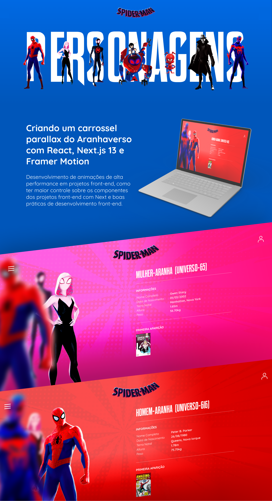

# Projeto Into the Spiderverse

Este é o repositório do projeto Into the Spiderverse, desenvolvido durante uma live no Youtube em parceria com a [DIO](https://dio.me). O projeto consiste em uma aplicação interativa inspirada no universo do Homem-Aranha, usando as principais stacks front-end: React, Next.js 13, a biblioteca Framer Motion, Sass e TypeScript para criar um projeto visual incrível e de alta performance.

[Demonstração do projeto.webm](./public/demo.webm)

## 💻 Tecnologias utilizadas no projeto

- [React.js](https://reactjs.org) (v18)
- [Next.js](https://nextjs.org) (v13)
- [TypeScript](https://www.typescriptlang.org) (v5)
- [ESLint](https://eslint.org)
- [Framer Motion](https://www.framer.com/api/motion)
- [SASS](https://sass-lang.com)

## 📚 Materiais

- [Link da live no Youtube](https://www.youtube.com/watch?v=d5HVw12uOpk)
- [Material de apoio com tutorial completo](https://micheleambrosio.notion.site/Live-Criando-um-carrossel-parallax-do-Aranhaverso-com-React-Next-js-13-e-Framer-Motion-67a818e32c2049d39d28ce4a185555c4?pvs=4)
- [Assets](https://drive.google.com/drive/folders/150O6eEhs8oGaHMMss7_CYG2jnI7yMugO?usp=sharing) (arquivos de imagens e efeitos sonoros)

## 🌿 Branches

- `main` projeto finalizado com todas as features implementadas durante a live.

## 🎨 Protótipo do projeto

[Clique aqui](https://www.figma.com/file/tdCIzlGKVdZJmKSaV99iDU/Landpage---SpiderVerse?type=design&node-id=0%3A1&t=rZMG8Ic2KXC3Dwfn-1) para ir ao protótipo do projeto no Figma.

## 🗄️ Estrutura de pastas

O projeto está estruturado da seguinte forma:

- 📁 `public`
  - 📁 `icons`
  - 📁 `songs`
  - 📁 `spiders`
- 📁 `src`
  - 📁 `app`
    - 📁 `api`
      - 📁 `heroes`
    - 📁 `hero`
      - 📁 `[id]`
  - 📁 `components`
    - 📁 `Carousel`
    - 📁 `HeroDetails`
    - 📁 `HeroesList`
    - 📁 `HeroPicture`
  - 📁 `fonts`
  - 📁 `interfaces`

## 🛠️ Instruções de execução

Siga as instruções abaixo para rodar o projeto em seu ambiente local:

```bash

1. Certifique-se de ter o Node.js instalado em seu computador. Você pode baixar a versão mais recente do Node.js em https://nodejs.org.

2. Clone este repositório em seu computador ou faça o download do código fonte.

3. Abra o terminal e navegue até o diretório raiz do projeto.

4. Instale as dependências do projeto executando o seguinte comando:

  yarn install

```

5. Após a conclusão da instalação das dependências, inicie o servidor de desenvolvimento local com o comando:

```bash
  yarn dev
```

6. O servidor local será iniciado e você poderá acessar o projeto no seu navegador através do seguinte endereço:

```bash
  http://localhost:3000
```

Caso a porta 3000 estiver em uso, automaticamente o Next.js irá subir na próxima porta livre da máquina.

Se deseja alterar a porta padrão na qual a aplicação tentará subir, você pode modificar a porta no arquivo `next.config.js`.

Agora você está pronto para explorar o projeto em seu ambiente local!

<hr>

Projeto desenvolvido em aula da instrutora [Michele Ambrosio](https://github.com/micheleambrosio), na live da [DIO](https://dio.me).
